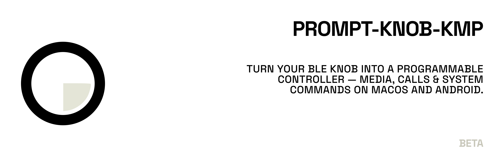

# PromptKnob

The companion app for the PromptKnob — a BLE rotary controller that maps a physical knob to media, meetings, and system commands on **macOS** and **Android**.

## Overview

PromptKnob is a Kotlin Multiplatform companion app for the PromptKnob hardware (an ESP32-based rotary knob). Connect over BLE, bind rotation, taps, and swipes to real actions — play/pause, mute, volume, brightness, shell commands, or Google Assistant prompts — and manage everything from a shared Compose Multiplatform UI. On macOS it doubles as a human-in-the-loop control surface for Claude Code via MCP and hooks.

Built with a modular architecture: full build system, Koin DI, type-safe navigation, a complete UI component library, onboarding, settings, presets, and localisation/theme infrastructure.

## Build Commands

```bash
# Build Android debug APK
./gradlew :aos-application:assembleDebug

# Run all checks
./gradlew check

# Build iOS debug framework (used by Xcode)
./gradlew :compose-application:linkDebugFrameworkIosArm64

# Clean build
./gradlew clean
```

For iOS, open `ios-application/` in Xcode 16+ and run from there.

## Tech Stack

| Aspect | Library |
|---|---|
| UI | Compose Multiplatform 1.10.2, Material3 |
| State management | Orbit MVI 11.0.0 |
| Dependency injection | Koin 4.1.1 |
| Navigation | AndroidX Navigation 3 |
| Preferences | multiplatform-settings 1.3.0 |
| Serialization | kotlinx-serialization 1.6.0 |
| Coroutines | kotlinx-coroutines 1.9.0 |
| Build | Gradle 9.1.0, Kotlin 2.3.20, JVM 21 |
| Android | minSdk 27, targetSdk 36 |

## Prerequisites

- Android Studio Ladybug or newer
- Xcode 16+ (for iOS)
- JDK 21

## How To

| Task | Guide |
|---|---|
| Use this project as a template | [How To: Use as Template](docs/how-to/use-as-template.md) |
| Build & run on Android | [How To: Run on Android](docs/how-to/run-android.md) |
| Build & run on iOS | [How To: Run on iOS](docs/how-to/run-ios.md) |
| Add a feature screen | [Development: Add a Feature](docs/development/add-feature.md) |
| Add a new module | [Development: Add a Module](docs/development/add-module.md) |
| Change theme colours or typography | [How To: Change Theme](docs/how-to/change-theme.md) |
| Add a localisation string | [How To: Add Localisation](docs/how-to/add-localisation.md) |

## Built-in Presets

The app ships with ready-made preset packs per platform. Open **Presets** in the app, tap a gallery card to import it, and the command tree syncs to the device immediately.

### macOS presets

| Preset | Commands | Type |
|--------|----------|------|
| **Media** | Play/Pause · Next Track · Prev Track · Volume Up · Volume Down | SYSTEM |
| **Focus** | Mic Toggle · Mute · Lock Screen · Stay Awake | SYSTEM |
| **Display** | Brightness Up · Brightness Down · Mission Control · Show Desktop | SYSTEM |
| **Terminal** | Open Terminal · Open VS Code · Say Done · Screenshot | SHELL + SYSTEM |

### Android presets

| Preset | Commands | Type |
|--------|----------|------|
| **Commute** | Navigate home · Show traffic to work | PROMPT (Google Assistant) |
| **Music** | Play my liked songs on YouTube Music · Play lo-fi playlist | PROMPT |
| **Daily** | What's on my calendar today? · Turn off the lights | PROMPT |

Android presets use Google Assistant voice commands via `AssistantPromptExecutor`. Requires **AssistantRobotService** to be enabled in Accessibility Settings.

> iOS and Desktop do not ship built-in presets. Users can create their own and export/import them as JSON.

---

## Hardware & Firmware

PromptKnob is built around an **ESP32** microcontroller. The companion app (this repo) communicates with the device over BLE using the YAMK wire protocol.

### Device specification

| Component | Details |
|-----------|---------|
| MCU | ESP32 (Xtensa LX6 dual-core, 240 MHz) |
| Wireless | Bluetooth 4.2 / BLE |
| Storage | 4 MB flash; NVS partition for command tree |
| Input | Rotary encoder — CW/CCW rotation, tap, swipe |
| Output | Display, RGB LEDs, haptic motor |
| USB | Micro-USB / USB-C via onboard USB-to-UART bridge |

### Flashing with PlatformIO

```bash
# Install PlatformIO
pip install platformio

# Clone firmware repository
git clone https://github.com/andrew-malitchuk/prompt-knob-firmware.git
cd prompt-knob-firmware

# Build and flash (auto-detects serial port)
pio run -t upload

# Open serial monitor
pio device monitor
```

For complete flashing instructions, driver setup, and troubleshooting see the firmware docs:

| Guide | Link |
|-------|------|
| Firmware overview | [docs/firmware/overview.md](docs/firmware/overview.md) |
| Hardware specification | [docs/firmware/hardware.md](docs/firmware/hardware.md) |
| Development environment | [docs/firmware/development.md](docs/firmware/development.md) |
| Flashing | [docs/firmware/flashing.md](docs/firmware/flashing.md) |
| BLE / YAMK protocol | [docs/development/ble-protocol.md](docs/development/ble-protocol.md) |

---

## Claude Code Integration

When the macOS companion app is running and a PromptKnob device is connected, it exposes two local servers that together make the knob a **human-in-the-loop control surface** for Claude Code.

```
Claude Code
    ├── MCP tools (JSON-RPC/SSE) ──▶ macOS app :7474 ──┐
    └── Hooks   (HTTP POST)      ──▶ macOS app :7777 ──┤
                                                        │ BLE (YAMK)
                                                        ▼
                                               PromptKnob (ESP32)
```

### Two channels, two roles

| Channel | Port | Direction | What it does |
|---------|------|-----------|--------------|
| **MCP server** | 7474 | Claude → knob → Claude | Interactive tools: block and wait for a physical response |
| **Hook server** | 7777 | Claude → knob | Passive overlay: shows Claude's working state on the device screen |

---

### Hook server — activity overlay

Claude Code hooks POST a state string to `:7777/state` on every tool use. The macOS app forwards the state over BLE and the device screen reacts automatically:

| Hook event | State sent | Device screen |
|------------|-----------|---------------|
| `PreToolUse` | `working` | Orange ring `WORKING...` — Claude is busy |
| `PostToolUse` | `done` | Green ring `DONE ✓` — auto-dismisses after 1.5 s |
| `Notification` | `waiting` | Red ring `WAITING` — Claude needs your attention |
| `Stop` | `idle` | Overlay dismisses — session ended |

Add the following to `~/.claude/settings.json`:

```json
{
  "hooks": {
    "PreToolUse":  [{ "hooks": [{ "type": "command", "command": "curl -s -X POST http://127.0.0.1:7777/state -d 'working' 2>/dev/null || true" }] }],
    "PostToolUse": [{ "hooks": [{ "type": "command", "command": "curl -s -X POST http://127.0.0.1:7777/state -d 'done'    2>/dev/null || true" }] }],
    "Stop":        [{ "hooks": [{ "type": "command", "command": "curl -s -X POST http://127.0.0.1:7777/state -d 'idle'    2>/dev/null || true" }] }],
    "Notification":[{ "hooks": [{ "type": "command", "command": "curl -s -X POST http://127.0.0.1:7777/state -d 'waiting' 2>/dev/null || true" }] }]
  }
}
```

The overlay auto-shows and auto-hides — no manual navigation required.

---

### MCP tools — interactive control

The `.mcp.json` in the project root registers the MCP server. Claude Code connects automatically and gains three tools:

| Tool | Blocks | Purpose |
|------|--------|---------|
| `request_approval` | Yes (30 s) | Show an approve / reject screen. User taps to approve or swipes to reject. |
| `request_choice` | Yes (30 s) | Show a scrollable list. User rotates encoder to navigate, taps to confirm. |
| `notify` | No | Fire-and-forget notification with haptic / LED feedback. |

---

### User flows

#### 1. Normal task — hooks only

```
You: "Refactor the BleRepository"

Claude starts reading files
  → PreToolUse  → device: orange WORKING...
  → PostToolUse → device: green DONE ✓ (disappears after 1.5 s)
  → PreToolUse  → device: orange WORKING... (next file)
  → PostToolUse → device: green DONE ✓
  ...
Claude finishes, writes response
  → Stop        → overlay gone, device back to wheel
```

You work on other things. The knob shows what Claude is doing without touching the keyboard.

---

#### 2. Risky operation — `request_approval`

```
You: "Reset the branch to origin/main"

Claude: recognises `git reset --hard` → calls request_approval
  → Device: SCR_APPROVAL "Reset to origin/main?"
  → You: tap centre circle                    → approved → Claude executes
     or swipe right                           → rejected → Claude stops
     or wait 30 s                             → timeout  → Claude stops
```

The knob physically gates destructive operations — Claude will not proceed without a response.

---

#### 3. Ambiguous request — `request_choice`

```
You: "Which approach should I use for the new screen?"

Claude: 2–4 valid options → calls request_choice
  → Device: scrollable list ["ViewModel + State", "Plain composable", "Cancel"]
  → You: rotate encoder to highlight, tap to confirm
  → Claude continues with the selected option
```

---

#### 4. Task complete — `notify`

```
Claude finishes a long build or test run
  → calls notify("Build OK", level="success")
  → Device: brief green notification overlay + haptic pulse
  → Claude continues
```

Useful when you step away and want a physical signal that the task is done.

---

### Quick start

1. Build and run the macOS app: `./gradlew :compose-application:runReleaseMacosArm64`
2. Connect your device: **Devices** → tap the knob in the scan list → wait for **Connected**
3. Add the hooks block above to `~/.claude/settings.json`
4. Run Claude Code from this directory — `.mcp.json` registers the MCP server automatically

For a complete setup walkthrough, tool reference, and troubleshooting see [MCP Setup](docs/user-guide/mcp-setup.md).

---

## License

Apache 2.0 License

```
Copyright (c) 2026 Andrew Malitchuk

Licensed under the Apache License, Version 2.0 (the "License");
you may not use this file except in compliance with the License.
You may obtain a copy of the License at

    http://www.apache.org/licenses/LICENSE-2.0

Unless required by applicable law or agreed to in writing, software
distributed under the License is distributed on an "AS IS" BASIS,
WITHOUT WARRANTIES OR CONDITIONS OF ANY KIND, either express or implied.
See the License for the specific language governing permissions and
limitations under the License.
```
