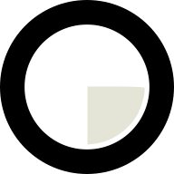

  
  <h1 style="margin-top: 16px;">PromptKnob</h1>

**PromptKnob** is a Kotlin Multiplatform companion app for the PromptKnob hardware — a BLE
rotary knob built around an **ESP32**. Connect over BLE, bind rotation, taps, and swipes to
real actions (media, system, shell commands, Google Assistant prompts), and manage everything
from a shared Compose Multiplatform UI.

The knob's firmware lives in a separate repository:
[prompt-knob-firmware](https://github.com/andrew-malitchuk/prompt-knob-firmware).

Primary platforms are **macOS** and **Android**; the shared Compose module also builds iOS and
Desktop/JVM targets. On macOS the app doubles as a human-in-the-loop control surface for
**Claude Code** via an MCP server and a hook overlay.

## Documentation map

| Section | What's inside |
|---------|---------------|
| [Getting Started](getting-started/prerequisites.md) | Prerequisites, setup, build commands, platforms |
| [How-To](how-to/run-android.md) | Run on Android/iOS, change theme, add localisation, reuse as a template |
| [Architecture](architecture/overview.md) | Layered design, module structure, convention plugins, patterns |
| [Modules](modules/common-core.md) | Reference for every Gradle module |
| [Development](development/add-feature.md) | Add a feature, add a module, BLE/YAMK protocol |
| [Firmware](firmware/overview.md) | ESP32 device, hardware spec, flashing (firmware repo is separate) |
| [User Guide](user-guide/getting-started-android.md) | End-user setup on Android & macOS, Claude Code MCP setup |
| [Roadmap](roadmap.md) | Product direction |

## At a glance

- **35 Gradle modules**, layered presentation → domain → data → common-core, API/Impl split.
- **Compose Multiplatform** UI with **Orbit MVI**, **Koin** DI, **Room** persistence,
  **Ktor** for the MCP/hook servers, and Navigation 3.
- Kotlin 2.3.20, Gradle 9.1.0, JVM target 21; Android minSdk 27 / targetSdk 36.

See the repository [`README.md`](https://github.com/andrew-malitchuk/prompt-knob-kmp/blob/main/README.md)
for the top-level overview, preset packs, and the Claude Code integration reference.
